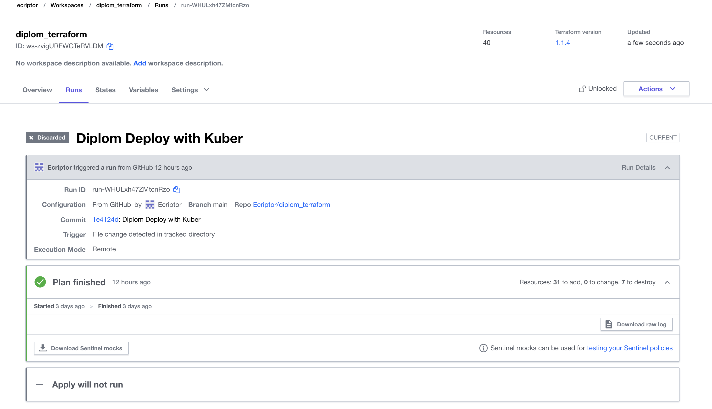
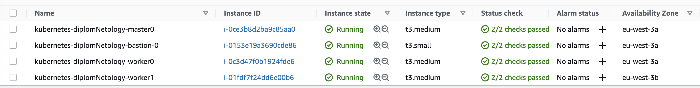

# Дипломный практикум в Cloud: Amazon Web Services"

## Цели:

1. Подготовить облачную инфраструктуру на базе облачного провайдера AWS.
2. Запустить и сконфигурировать Kubernetes кластер.
3. Установить и настроить систему мониторинга.
4. Настроить и автоматизировать сборку тестового приложения с использованием Docker-контейнеров.
5. Настроить CI для автоматической сборки и тестирования.
6. Настроить CD для автоматического развёртывания приложения.

## Этапы выполнения:

### Создание облачной инфраструктуры

Последнюю стабильную версию Terraform установил при помощи Brew:

```
~/Netology  terraform --version                                                                                
Terraform v1.1.4
on darwin_amd64
```

В качестве backend используется Terraform Cloud (TFC)  
Доступ к удаленному backend для CLI-утилиты будет обеспечен за счёт указания токена пользователя TFC в файле `~/.terraformrc`.

В доп.материалах kubespray уже имеется манифест Terraform для организации инфраструктуры в AWS.  
Содержимое репозитория kubespray скопировал в свой репозиторий. Манифесты Terraform располагаются в папке [contrib/terraform/aws](https://github.com/Ecriptor/diplom_terraform/tree/main/contrib/terraform/aws).

Настроим доступ в AWS: присланные доступы добавим в файл `~/.aws/credentials`, а также добавляем их в файл с переменными для Terraform - `credentials.auto.tfvars` (добавлен в .gitignore).  

SSH-ключ `diplom-key` для подключения к создаваемым инстансам создал локально и через и через web оснастку добавил в AWS

Предложенный разработчиками kubespray манифест Terraform дополнил файлом:
- [create-ingress-elb.tf](https://github.com/Ecriptor/diplom_terraform/tree/main/contrib/terraform/aws/create-ingress-elb.tf) - создаём дополнительный балансер для доступа к сервисам в кластере через ингресс-контроллеры

---

Перейдём в каталог с шаблонами манифестов Terraform, а затем произведём инициацию бэкенда и создание workspace:

```
cd contrib/terraform/aws/
terraform workspace new stage
terraform init
```

Теперь, когда workspace создан, можно запустить деплой (тк в шаблонах от разработчиков kuberspray еще создавались роуты и пользователи, а в аккаунте от Нетологии это не поддерживается и теперь нельзя удалить данных пользователей тк не хватает прав то пришлось использовать локальный apply).
- [workspace-terraform](https://app.terraform.io/app/ecriptor/workspaces/diplom_terraform)

```
terraform plan
terraform apply
```
#### Результат:


-


### Создание Kubernetes кластер

### Установка системы мониторинга

### Настройка автоматической сборки докер контейнера с приложением


